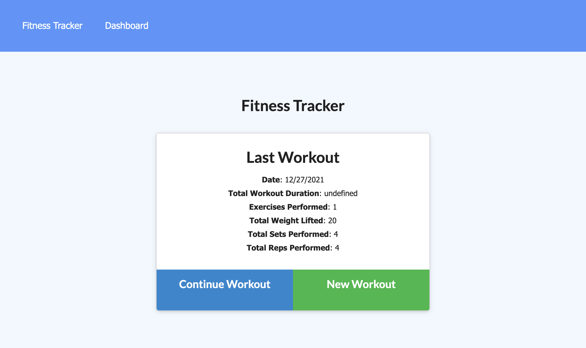
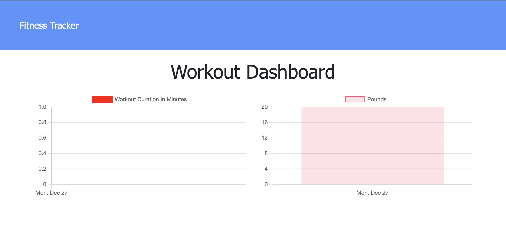

# Fitness Tracker


## Description
This application creates backend logic to existing frontend development for a Fitness Tracker. It requires the creation of a Mongo database with a Mongoose schema and handles routes with Express.

## Table of Contents
- [Important URLs](#urls)
- [Foreword](#foreword)
- [Usage](#usage)
- [User Story](#user-story)
- [Acceptance Criteria](#acceptance-criteria)
- [Mockup](#mockup)
- [Packages](#packages)
- [Contributors](#contributors)
- [License](#Licensing)

## URLs
- [Github Repo](https://github.com/candracodes/fitness-tracker)
- [Deployed Heroku Application](https://candra-fitness-tracker.herokuapp.com/)
- [Full Acceptance Criteria](./assets/README.md)

## Usage
- To run this application locally:
```
1. Download the repo
2. npm install
3. npm run seed
4. node server.js or npm start
```

## User-Story

```md
As a user, I want to be able to view create and track daily workouts. I want to be able to log multiple exercises in a workout on a given day. I should also be able to track the name, type, weight, sets, reps, and duration of exercise. If the exercise is a cardio exercise, I should be able to track my distance traveled.
```

## Acceptance-Criteria
When the user loads the page, they should be given the option to create a new workout or continue with their last workout.

The user should be able to:

  * Add exercises to the most recent workout plan. ✅

  * Add new exercises to a new workout plan. ✅

  * View the combined weight of multiple exercises from the past seven workouts on the `stats` page. ✅

  * View the total duration of each workout from the past seven workouts on the `stats` page. ❌

## Mockup



## Packages

This project is created using the following packages
- [Node.JS](https://nodejs.org/en/)
- [Express.JS](https://expressjs.com/)
- [MongoDB](https://www.mongodb.com/)
- [Mongoose](https://www.npmjs.com/package//mongoose)
- [Morgan](https://www.npmjs.com/package/morgan)

## Contributors
This project was made possible with the help of my bootcamp tutor, David Johnson.

## Licensing
The project is made possible with the following Licensing:
- [MIT](license.txt)


